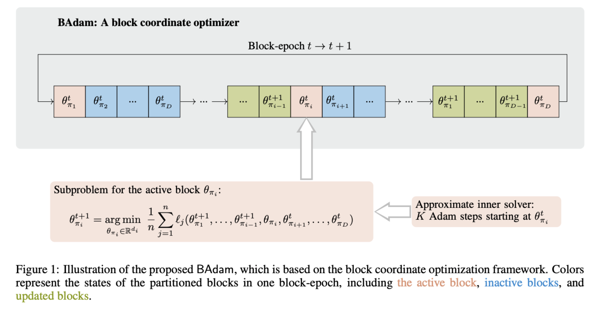

# A TASTE OF LLM

## Try Meta LLaMA

[Introducing Meta Llama 3: The most capable openly available LLM to date](https://ai.meta.com/blog/meta-llama-3/)

[Llama3 Github](https://github.com/meta-llama/llama3/blob/main/README.md)

[Llama3 HuggingFace](https://huggingface.co/meta-llama/Meta-Llama-3-8B)

```Python
import torch
from transformers import AutoTokenizer, AutoModelForCausalLM, BitsAndBytesConfig
from torch.nn import DataParallel
import os

os.environ["CUDA_VISIBLE_DEVICES"] = "0,1"

print("gpu device count:", torch.cuda.device_count())

quant_config=BitsAndBytesConfig(
            load_in_8bit=True,
            #bnb_4bit_compute_dtype=torch.float16
        )

tokenizer = AutoTokenizer.from_pretrained("meta-llama/Meta-Llama-3-8B-Instruct")
model = AutoModelForCausalLM.from_pretrained("meta-llama/Meta-Llama-3-8B-Instruct",
                                             quantization_config=quant_config,
                                             low_cpu_mem_usage=True)

from transformers import pipeline

textgen = pipeline(
    "text-generation",
    model=model,
    device_map="auto",
    tokenizer=tokenizer
    )

sequences = textgen(
    "i want to start up a company, firstly i should",
    do_sample=True,
    top_k=10,
    num_return_sequences=1,
    eos_token_id=tokenizer.eos_token_id,
    max_length=1024,
    truncation=True,
)
for seq in sequences:
    print(f"Result: {seq['generated_text']}")
```

## Tokenizer

[Hugging Face Tokenizer Course](https://huggingface.co/learn/nlp-course/en/chapter2/4?fw=pt)

[Tiktokenizer](https://github.com/openai/tiktoken)

[Try Tokenize Online!](https://platform.openai.com/tokenizer)

**[Byte pair encoding](https://en.wikipedia.org/wiki/Byte_pair_encoding#cite_note-2022Book_-8)**
In the first step, assumes all unique characters to be an initial set of 1-character long n-grams (i.e. initial "tokens"). Then, successively the most frequent pair of adjacent characters is merged into a new, 2-character long n-gram and all instances of the pair are replaced by this new token. This is repeated until a vocabulary of prescribed size is obtained. Note that new words can always be constructed from final vocabulary tokens and initial-set characters.

## Sampling


Trade-off between randomness and predictability in the model's output.

- **Greedy Decoding**: *argmax* at each step.
- **Beam Search**: *argmax* over multiple candidate sequences.
- **Sampling with Temperature**
$$probilities=softmax(\frac{logits}{temperature})$$
    - A temperature close to zero makes the distribution sharper, meaning the model is more likely to choose the word with the highest probability.
    - As the temperature increases, the distribution becomes flatter, and the model is more likely to choose a less probable word. In other words, higher temperatures lead to more randomness and diversity in the generated text.
- **Top-k Sampling**: keep top k tokens.
- **Top-p Sampling**: Only considers the smallest set of top words whose cumulative probability exceeds a certain threshold, $p$. 


## Fine-tuning

### Parameter Efficient Finetuning (PEFT)
An effective strategy for finetuning LLMs is to train a small number of trainable parameters that are added to the original base model, while keeping the majority of the pretrained parameters frozen. 
PEFT may yield suboptimal performance for downstream tasks compared to full parameter finetuning.

- [LoRA: Low-Rank Adaptation of Large Language Models](https://arxiv.org/pdf/2106.09685)

$$
\begin{align}
h&=(\overbrace{W_0}^{frozen}+\overbrace{BA}^{trainable})x\\
W_0&\in\mathbb{R}^{d\times k} \\
B&\in\mathbb{R}^{d\times r} \\
A&\in\mathbb{R}^{r\times k} \\
r&\ll\min{(d,k)}
\end{align}
$$

### Memory Efficient Full Parameter Finetuning

Fine-tune with limited (GPU) memory.

- [LOMO: Full Parameter Fine-Tuning for Large Language Models with Limited Resources](https://arxiv.org/pdf/2306.09782)
- [AdaLomo: Low-memory Optimization with Adaptive Learning Rate](https://arxiv.org/abs/2310.10195)
有限内存的SGD优化方法，收敛较慢。后续改进成AdaLomo，[实现的代码地址](https://github.com/OpenLMLab/LOMO)


- [BAdam: A Memory Efficient Full Parameter Training Method for Large Language Models](https://arxiv.org/abs/2404.02827)
 支持单卡（RTX 3090, 显存24G）微调 Llama3-8B


## Quantization
Quantization is a model compression technique that converts the weights and activations within an LLM from a high-precision data representation to a lower-precision data representation, i.e., from a data type that can hold more information to one that holds less. A typical example of this is the conversion of data from a 32-bit floating-point number (FP32) to an 8-bit or 4-bit integer (INT4 or INT8). 

$$
x_q=round(\frac{x}{S}+Z)
$$

### LLM Quantization Types

- **Post-Training Quantization (PTQ)**
Quantize an LLM after it has already been trained. PTQ is easier to implement than QAT, as it requires less training data and is faster. 

- **Quantization-Aware Training (QAT)**
Fine-tuning on data with quantization in mind. In contrast to PTQ techniques, QAT integrates the weight conversion process, i.e., calibration, range estimation, clipping, rounding, etc., during the training stage. This often results in superior model performance, but is more computationally demanding. 

### Quantization Techniques
- **Quantized Low-Rank Adaptation (QLoRA)**
 Optimize LoRA by quantizing the original weights within the base LLM to 4-bit: reducing the memory requirements of an LLM to make it feasible to run on a single GPU.
- **Pruned and Rank-Increasing Low-Rank Adaptation (PRILoRA)**
  1) **Linear Distribution of ranks**: the low-rank r is the same across all the LLM’s layers in LoRA, PRILoRA linearly increases the rank for each layer. For example, the researchers who developed PRILoRA started with r = 4 and increased the rank until r = 12 for the final layer – producing an average rank of 8 across all layers. 
  2) **Ongoing pruning on the A matrix**: eliminating the lowest, i.e., least significant weights every 40 steps throughout the fine-tuning process.

- **Aware Weight Quantization (AWQ)**
 The first stage of AWQ is using a calibration data subset to collect activation statistics from the model, i.e., which weights are activated during inference. These are known as salient weights, which typically comprise less than 1% of the total weights. The salient weights are skipped over for quantization to increase accuracy, remaining as an FP16 data type. Meanwhile, the rest of the weights are quantized into INT3 or INT4 to reduce memory requirements across the rest of the LLM. 

### 1-bit Quantization
- [BitNet: Scaling 1-bit Transformers for Large Language Models](https://arxiv.org/pdf/2310.11453)
- [The Era of 1-bit LLMs: All Large Language Models are in 1.58 Bits](https://arxiv.org/pdf/2402.17764)
- [OneBit: Towards Extremely Low-bit Large Language Models](https://arxiv.org/pdf/2402.11295)

### [Llama.cpp](https://github.com/ggerganov/llama.cpp)

The main goal of llama.cpp is to enable LLM inference with minimal setup and state-of-the-art performance on a wide variety of hardware - locally and in the cloud.

* Plain C/C++ implementation without any dependencies
* Apple silicon is a first-class citizen - optimized via ARM NEON, Accelerate and Metal frameworks
* AVX, AVX2 and AVX512 support for x86 architectures
* 1.5-bit, 2-bit, 3-bit, 4-bit, 5-bit, 6-bit, and 8-bit integer quantization for faster inference and reduced memory use
* Custom CUDA kernels for running LLMs on NVIDIA GPUs (support for AMD GPUs via HIP)
* Vulkan, SYCL, and (partial) OpenCL backend support
* CPU+GPU hybrid inference to partially accelerate models larger than the total VRAM capacity

## Prompt Engineering

### CoT (Chain-of-Thought)
[Chain-of-Thought Prompting Elicits Reasoning in Large Language Models](https://arxiv.org/pdf/2201.11903)


### RAG (Retrieval-Augmented Generation)

解决知识截止时间、幻想等问题，主流应用范式。

Retrieval-augmented generation (RAG) is a technique for enhancing the accuracy and reliability of generative AI models with facts fetched from external sources.

[Retrieval-Augmented Generation for Knowledge-Intensive NLP Tasks](https://arxiv.org/pdf/2005.11401)


## LLM List

[开源基础大模型](https://github.com/wgwang/awesome-open-foundation-models)
[中国大模型](https://github.com/wgwang/awesome-LLMs-In-China)
[大语言模型分类](https://github.com/HqWu-HITCS/Awesome-Chinese-LLM?tab=readme-ov-file)

## LLM Application Open-Source Lib

- **[LangChain](https://python.langchain.com/docs/get_started/introduction)**

 LangChain is a framework for developing applications powered by large language models (LLMs).

 For these applications, LangChain simplifies the entire application lifecycle:

 - Open-source libraries: Build your applications using LangChain's modular building blocks and components. Integrate with hundreds of third-party providers.
 - Productionization: Inspect, monitor, and evaluate your apps with LangSmith so that you can constantly optimize and deploy with confidence.
 - Deployment: Turn any chain into a REST API with LangServe.

## Application in Industry

- **Private LLM**
让大模型学会企业知识和业务流程，提升准确率和多模态输出

- [AI大模型工业应用现状、模式与展望](https://www.china-aii.com/newsinfo/6697028.html?templateId=1562271)
